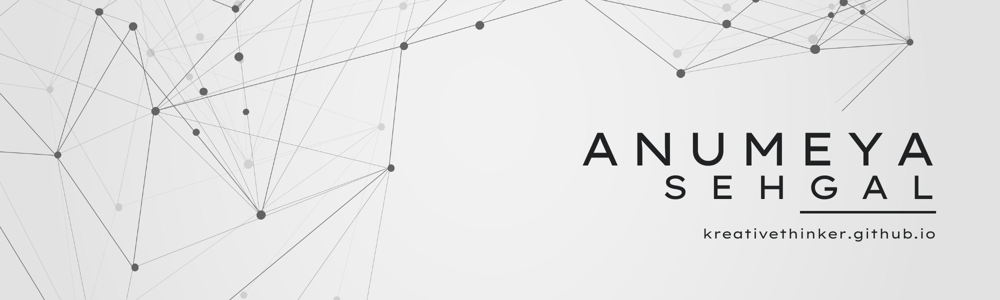

  

## 👋 About Me

I'm Anumeya — a **backend-focused full-stack developer** building across **AI, mobile, systems, and developer tools**.

- 💻 Obsessed with modular, fast, and clean builds
- 🛠 Strong with **Python**, **FastAPI**, **Docker**, **PostgreSQL**, **React Native**, **Linux**
- 🌐 Built full-stack apps, gesture-based control systems, and Chrome extensions
- 🧪 Contributed to national hackathons: **DevsHouse**, **Shaastra IITM**, **Zypher**
- 🔧 Backend lead @ **Linux Club, VIT Chennai**

> 🧩 _"Making life easier, one project at a time."_

---

## ⚒️ Tech Stack

  
**Languages**  

**Frameworks & Libraries**  

**Databases & ORMs**  

**Styling & UI Design**  

**DevOps & Tools**  

## 📊 GitHub Stats

  <table>
    <tr>
      <td></td>
      <td></td>
    </tr>
    <tr>
      <td colspan="2">
</td>
    </tr>
  </table>

